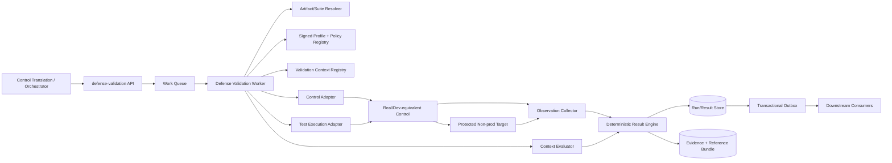
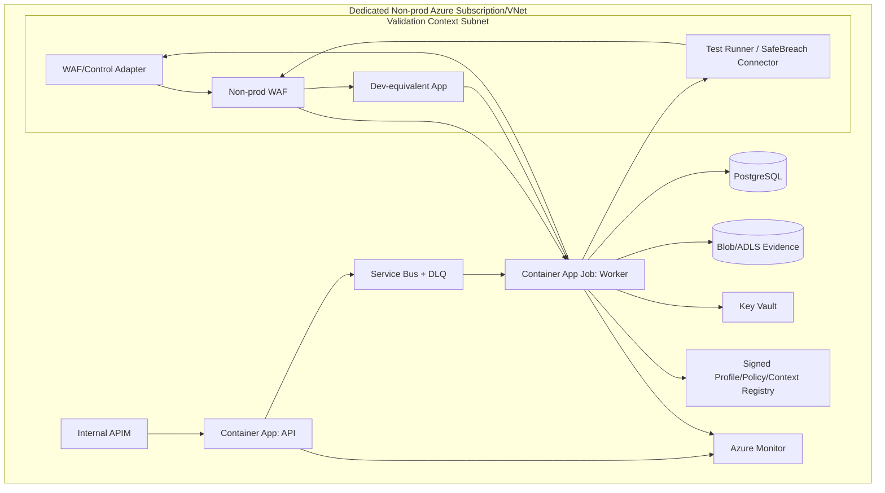
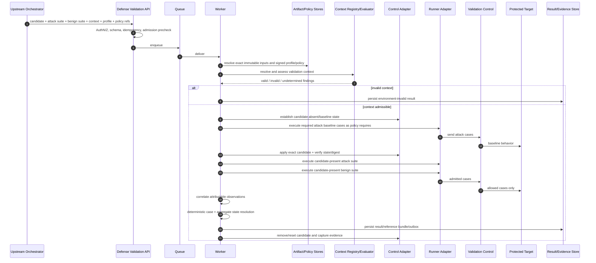
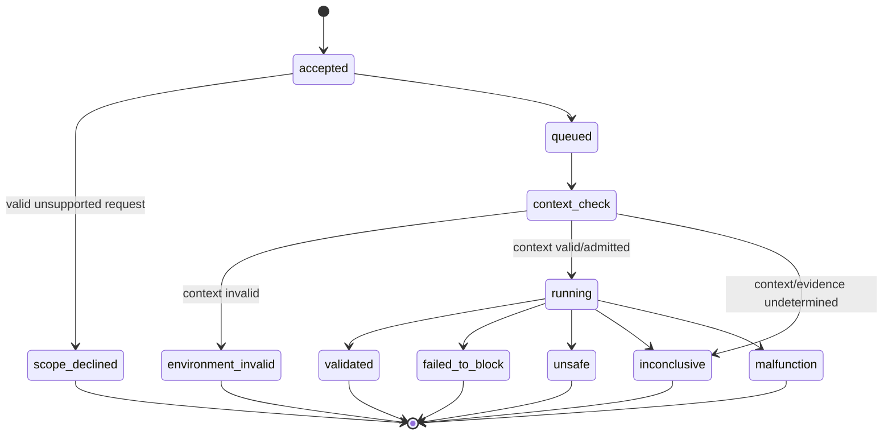

# `defense-validation` Low-Level Design

**Document ID:** `defense-validation-lld`  
**Capability contract:** `defense-validation@1.0`  
**Document version:** `0.1`  
**Status:** `Draft`  
**Primary source:** `cfs-defense-validation.md`  
**Owner:** `Janus / Security Validation Engineering`  
**Reviewers:** `architecture, security, product, engineering, operations`  
**Last updated:** `2026-08-13`

> **Authoring rule:** This LLD preserves the CFS boundary. Proposed cloud services, adapter APIs, persistence technology, and orchestration choices are implementation choices and do not change the capability contract.

---

## 1. Purpose

`defense-validation` validates an **exact translated defensive control candidate** in a selected real or dev-equivalent control context. It applies the exact candidate, establishes candidate state, executes the required attack/test suite, executes the required representative benign suite, mechanically observes control and target behavior, assesses context validity, and emits a bounded efficacy/no-harm result with explicit proof strength.

The capability is broader and later than `mitigation-check`: it validates real control semantics and representative benign behavior. It still does not authorize production deployment, measure production blast radius or SLO impact, establish universal bypass resistance, or emit coverage facts.

### 1.1 Capability boundary

> Determine whether the exact translated candidate blocks all policy-required attack/test cases and preserves all policy-required benign outcomes in the selected valid real or dev-equivalent validation context.

### 1.2 Design goals

- Bind every result to the exact candidate ID/digest/translation ancestry actually applied.
- Validate context fidelity, isolation/reset, candidate application state, and observation fitness before candidate judgment.
- Preserve direct/indirect/mixed proof strength at case and aggregate levels.
- Require both efficacy evidence and representative benign no-harm evidence for `validated`.
- Preserve uncertainty/conflicts rather than converting incomplete evidence into positive or negative security claims.
- Make result and reference bundle sufficient for later review without rerunning validation.

### 1.3 Non-goals

The capability does not:

- generate or translate a mitigation candidate;
- generate proof-of-vulnerability checks;
- own the fast proof-loop block/pass oracle;
- search for adversarial bypasses;
- author attack or benign suites;
- provision/accredit validation infrastructure;
- decide production safety/change authorization;
- deploy to a protected population or emit coverage/rollout-health facts;
- assess non-prod performance/SLO impact in v1.

### 1.4 Architectural stance

This is a **deterministic asynchronous validation orchestration service** over approved validation contexts.

- **CFS-mandated:** exact candidate binding, context validity first, established candidate state, attack and benign evidence, explicit proof strength, seven terminal states, uncertainty preservation, `unsafe` precedence over `failed-to-block`, bounded execution, no overclaim.
- **Proposed:** private API, queue workers, validation-context registry, control adapters, SafeBreach/test-runner adapters, deterministic result engine, PostgreSQL metadata, immutable object evidence/reference bundle.

---

## 2. CFS Summary and Requirement Extraction

### 2.1 CFS objective

Provide evidence that an exact translated defense behaves correctly on representative real/dev-equivalent control semantics before separate production-safety consideration.

### 2.2 Inputs

| Input | Type / schema | Authoritative source | Required? | Freshness / integrity rules |
|---|---|---|---:|---|
| Control-specific mitigation candidate | `ControlCandidate@1` | control-translation result/store | Yes | Exact immutable artifact/digest; target control class/technology/syntax; translation ancestry |
| Attack/test suite | `AttackSuite@1` | check-generation, BAS/SafeBreach, source-backed test source, discriminator source | Yes | Stable case IDs, expected absent/present behavior, proof strength/provenance |
| Representative benign suite | `BenignSuite@1` | approved suite repository | Yes | Stable cases, expected permitted outcomes, representativeness limits |
| Validation context | `ValidationContext@1` | approved context registry | Yes | Control/version/config fingerprint, application mechanism, isolation/reset, observation and fidelity evidence |
| Validation profile | `DefenseValidationProfile@1` | signed semantic registry | Yes | Approved immutable version; defines supported semantics/fidelity/suite sufficiency |
| Validation policy | `DefenseValidationPolicy@1` | signed semantic registry | Yes | Admission, proof handling, evidence completeness, state semantics, retention |

### 2.3 Outputs

| Output | Type / schema | Consumer | Persistence | Notes |
|---|---|---|---|---|
| Defense Validation Result | `DefenseValidationResult@1` | orchestration, reviewers, production-safety stage | Immutable | Authoritative structured result |
| Reference bundle | `DefenseValidationReferenceBundle@1` | security reviewers/audit | Immutable object store | Review material sufficient without rerun |
| Completion event | `janus.defense-validation.completed.v1` | downstream workflow | Outbox/event bus | At-least-once |
| Case observations | normalized attack/benign observations | result engine/audit | Immutable | Preserve negative and conflicting observations |

### 2.4 Required invariants

- Verdict binds to exact candidate identity, digest, translation result, target technology, and actually applied artifact.
- Every attack case and aggregate result disclose proof strength.
- Context validity must be established before efficacy/no-harm judgment.
- Candidate absent/present state must be attributable for required trials.
- Every required attack case must demonstrate expected baseline behavior and candidate-present blocked outcome for `validated`.
- Every required benign case must remain permitted for `validated`.
- Missing/stale/conflicting/contaminated/unattributable evidence remains visible and may force `inconclusive`.
- Valid unsupported requests yield `scope-declined`.
- Executable material is constrained to admitted candidate/suite material and cannot alter policy/scope/outcome semantics.
- If attack failure and benign regression coexist, keep both; `unsafe` governs.
- Generic rejections/rule hits/transport failures are not candidate-attributable blocking without required evidence.
- No result claims production safety, deployment authorization, live impact, performance safety, universal prevention, broad bypass resistance, or coverage.

### 2.5 Terminal states or completion outcomes

| State | Meaning | Required evidence | Downstream route |
|---|---|---|---|
| `validated` | Valid context; exact candidate state established; required attacks blocked; required benign cases preserved | Complete required context/candidate/attack/benign evidence | separate production-safety consideration |
| `failed-to-block` | Supported negative attack result, with no governing benign regression | ≥1 required attack not blocked; benign evidence per policy | candidate correction/rejection |
| `unsafe` | ≥1 required benign case regressed with candidate applied | benign regression evidence; retain attack findings | candidate correction/rejection |
| `environment-invalid` | Context fails fidelity/isolation/reset/config/observation requirements | context assessment | validation-context owner |
| `inconclusive` | In-scope but required evidence unresolved | gaps/conflicts/partial observations | evidence/substrate repair/manual review |
| `scope-declined` | Valid request outside configured coverage | admission finding | alternate profile/version |
| `malfunction` | Runtime cannot emit trustworthy domain result | diagnostics only | retry/ops/DLQ |

---

## 3. Deployable System Architecture

### 3.1 Graphical system architecture



### 3.2 Architecture planes

| Plane | Responsibility | Components | Trust boundary |
|---|---|---|---|
| Upstream | exact translated candidate + suites + context/profile/policy IDs | translation/orchestration | External |
| Private ingress | auth, schema, idempotency, admission | API | Capability edge |
| Runtime data plane | context validation, baseline, candidate apply, attack/benign execution, observations, verdict | worker/adapters/engine | Private compute |
| Semantic control plane | validation profiles, policies, context descriptors | signed registries | Restricted authoring |
| State/evidence | immutable result/reference bundle/audit | DB/object store | Private data |
| External execution | SafeBreach/vendor lab/control context | adapters | Explicit bounded integration boundary |

### 3.3 Runtime component inventory

| Deployable component | Runtime form | Responsibility | Identity / permissions | Scale model | Failure behavior |
|---|---|---|---|---|---|
| `defense-validation-api` | Container service | submit/status/result | Create runs/enqueue only | Horizontal | reject invalid/unauthorized |
| `defense-validation-worker` | Queue consumer/job | authoritative validation orchestration | read artifacts/context/policy; invoke adapters; write results | Horizontal, context-capacity bounded | retry/DLQ/malfunction |
| `context-evaluator` | In-process lib/service | validate context against profile | read signed context/profile only | Per worker | invalid => environment-invalid; unavailable evidence => inconclusive/malfunction as applicable |
| `control-adapter-*` | Plugin/service | apply/remove/verify exact candidate | only designated non-prod control policy | per mutable context | typed application/state errors |
| `test-execution-adapter-*` | Plugin/service | execute attack/benign cases | only declared validation path | per simulator/runner | typed case execution errors |
| `observation-normalizer` | library/service | correlate control/target/run evidence | read observations | horizontal | unattributable => inconclusive |
| `result-engine` | in-process | deterministic aggregate terminal state | none | per worker | invariant failure => malfunction |
| `reference-bundle-builder` | library | canonical review bundle | write object store | async/batched | before durable result => malfunction |

### 3.4 Trust boundaries and data classification

| Boundary | Data entering | Data leaving | Required controls |
|---|---|---|---|
| API | immutable refs/IDs | accepted run | OAuth/mTLS, RBAC, schema, size limits |
| Context registry | control/config/fidelity metadata | approved context binding | signatures/versioning, environment restrictions |
| Control adapter | exact native candidate | application/state evidence | non-prod-only rights, audit, no unrelated policy mutation |
| Runner adapter | admitted attack/benign material | execution references | target allowlist, no arbitrary code/target, timeout/resource limits |
| Evidence store | logs/traces/case outputs | sanitized reference bundle | redaction, digest, immutability, ACLs |

### 3.5 Control-plane artifact lifecycle

Profiles, policies, context descriptors, and adapter allowlists are versioned in source control, CI-validated, independently approved, signed, immutably published, and runtime-resolved by exact version/digest.

---

## 4. Prototype Cloud Deployment Architecture

### 4.1 Graphical Azure prototype topology



### 4.2 Azure resource bill of materials

| Azure resource | Proposed configuration | Purpose | Required for MVP? |
|---|---|---|---:|
| Dedicated non-prod subscription/RG | isolated from production | lifecycle/RBAC | Yes |
| VNet/private endpoints | runtime + validation subnet | isolation | Yes |
| ACA/AKS | API/worker/adapters | compute | Yes |
| Service Bus | queue/DLQ | async jobs | Yes |
| PostgreSQL | private | state/result/outbox | Yes |
| Blob/ADLS | immutable/versioned | evidence/reference bundles | Yes |
| Key Vault | managed identity | vendor/control secrets | Yes |
| Azure Monitor/App Insights | OTel | telemetry | Yes |
| ACR | signed images/SBOM | supply chain | Yes |

### 4.3 Network and identity rules

- No production control-plane access from validation worker/adapters.
- Control adapter identity is bound to a specific validation context and policy/rule group.
- Runner may reach only the declared validation ingress/target path.
- SafeBreach/vendor API endpoints are allowlisted; credentials stored in Key Vault.
- Production/non-production identities, keys, stores, and queues are separate.

### 4.4 Cloud portability mapping

Same abstractions as mitigation-check: private API, container runtime, queue, object storage, PostgreSQL, secrets, OTel, policy engine. Validation contexts may reside outside the hosting cloud as long as network/identity/fidelity requirements are met.

### 4.5 Container and service boundaries

| Image / service | Contents | Explicitly excludes |
|---|---|---|
| `defense-validation-api` | ingress/status/result | execution tools, control credentials |
| `defense-validation-worker` | orchestration/result logic | arbitrary production administration |
| `control-adapter-waf` | install/verify/remove exact translated rule | candidate generation/translation |
| `runner-adapter-safebreach` | scenario execution/result retrieval | control-policy mutation unless separately authorized adapter contract exists |

### 4.6 Terraform / IaC module layout

```text
infra/
├── environments/nonprod/
├── modules/
│   ├── network/
│   ├── api-gateway/
│   ├── runtime/
│   ├── queue-eventing/
│   ├── artifact-storage/
│   ├── state-store/
│   ├── key-vault/
│   ├── observability/
│   └── validation-context-connectivity/
└── policies/
    ├── deny-public-access/
    ├── deny-production-controls/
    ├── constrain-validation-targets/
    └── require-signed-semantic-artifacts/
```

### 4.7 Application repository layout

```text
src/
├── api/
├── worker/
├── domain/
│   ├── contracts/
│   ├── context/
│   ├── case_evaluation/
│   ├── aggregate_result/
│   ├── terminal_states/
│   └── invariants/
├── adapters/
│   ├── artifacts/
│   ├── control/
│   │   ├── modsecurity/
│   │   └── vendor_waf/
│   ├── runner/
│   │   ├── local_http/
│   │   └── safebreach/
│   ├── evidence/
│   ├── persistence/
│   └── events/
├── schemas/
└── tests/{unit,component,integration,security,conformance}/
```

---

## 5. End-to-End Runtime Processing Architecture

### 5.1 Processing sequence



### 5.2 Step-by-step processing rules

1. Accept immutable references for candidate, attack suite, benign suite, context, profile, policy.
2. Validate contract and caller authorization.
3. Compute stable replay identity.
4. Resolve candidate and verify digest/translation ancestry.
5. Resolve attack/benign suites and validate required case metadata.
6. Resolve signed profile/policy and evaluate configured coverage.
7. Resolve validation context and establish context validity before candidate judgment.
8. Establish candidate-absent state and execute required baseline attack behavior where policy requires.
9. Apply exact candidate through context-specific control adapter; verify active state and artifact identity.
10. Execute all policy-required attack cases and collect attributable control/target observations.
11. Execute all policy-required benign cases and collect permitted/blocked/altered observations.
12. Preserve missing/conflicting/contaminated evidence explicitly.
13. Resolve case conclusions and aggregate proof strength.
14. Resolve terminal state using precedence rules.
15. Persist structured result, complete negative observations, evidence bindings, limitations, reference bundle, audit, and outbox.
16. Remove/reset candidate and capture cleanup evidence.

### 5.3 State machine



---

## 6. Detailed Component Design

### 6.1 Defense Validation API

**Responsibility:** private submit/status/result interface; schema/auth/idempotency.  
**Inputs:** `SubmitDefenseValidationRequest@1`.  
**Outputs:** run/result identities.  
**Dependencies:** state DB, queue, semantic-registry metadata.  
**Identity:** no control mutation rights.  
**Failure behavior:** reject before execution when invalid/unauthorized.

### 6.2 Worker

**Responsibility:** authoritative workflow orchestration.  
**Dependencies:** artifact stores, policy/profile/context registries, control/runner adapters, evidence store.  
**Identity:** scoped invoke/read/write permissions.  
**Failure behavior:** bounded retries; never fabricate domain judgment.

### 6.3 Validation Context Evaluator

**Responsibility:** compare context claims/evidence to approved profile requirements.

Checks include:

- target control technology/version;
- relevant configuration fingerprint;
- candidate-application mechanism;
- isolation and reset fitness;
- traffic/control observation capabilities;
- required fidelity claims.

Output: `ContextAssessment{status: valid|invalid|undetermined, findings[]}`.

### 6.4 Control Adapter

```go
type ControlAdapter interface {
    EstablishBaseline(ctx context.Context, vc ValidationContext) (ControlState, error)
    Apply(ctx context.Context, vc ValidationContext, c ControlCandidate) (CandidateApplication, error)
    VerifyApplied(ctx context.Context, app CandidateApplication, expectedDigest string) (ControlState, error)
    RemoveOrReset(ctx context.Context, app CandidateApplication) (ResetEvidence, error)
}
```

The adapter applies the already translated exact candidate. It does not generate or translate it.

### 6.5 Test Execution Adapter

```go
type TestExecutionAdapter interface {
    ExecuteAttackCase(ctx context.Context, vc ValidationContext, c AttackCase) (CaseExecution, error)
    ExecuteBenignCase(ctx context.Context, vc ValidationContext, c BenignCase) (CaseExecution, error)
    CollectObservations(ctx context.Context, e CaseExecution) (NormalizedObservationSet, error)
}
```

Implementations may include local HTTP runners, SafeBreach/BAS connectors, endpoint runners, or vendor sandboxes admitted by profile.

### 6.6 Observation Correlator

Correlates candidate state, runner execution, control decision, target receipt/outcome, timestamps, and case identity. Generic rejection or rule-hit evidence is insufficient unless profile-required attribution semantics are satisfied.

### 6.7 Result Engine

Deterministically produces case conclusions, aggregate proof strength, context assessment, gaps/conflicts, and terminal state.

### 6.8 LLM/agent usage

No LLM is required for authoritative decisions. Optional summarization may generate `prose_summary` from structured fields only and is non-authoritative.

---

## 7. Domain Evaluation or Decision Architecture

### 7.1 Context validity

- Inputs: context descriptor/evidence + profile.
- Rules: exact supported technology/version/config/fidelity/isolation/reset/observation requirements.
- Missing/conflicting evidence: `undetermined`; aggregate result normally `inconclusive` unless profile violation proves `environment-invalid`.
- Invalid context: no efficacy/no-harm candidate judgment.

### 7.2 Candidate state integrity

Before candidate-present cases, prove exact candidate ID/digest is applied. Before required baseline cases, prove candidate absent. Stale/unknown state prevents `validated`, `failed-to-block`, or `unsafe` as a supported candidate judgment.

### 7.3 Attack case evaluation

Each case records:

- case identity and `proof_strength`;
- candidate-absent observation (`reached-vulnerable-behavior`, `reached-discriminator-target`, `unobservable`, `not-run`);
- candidate-present observation (`blocked`, `not-blocked`, `unobservable`, `not-run`);
- conclusion (`blocked-as-required`, `not-blocked`, `undetermined`);
- evidence refs.

### 7.4 Benign case evaluation

Each required case records expected permitted outcome, observed candidate-present outcome (`permitted`, `blocked`, `altered`, `unobservable`, `not-run`), conclusion (`preserved`, `regressed`, `undetermined`), and evidence refs.

### 7.5 Aggregate proof strength

- all required attack cases direct => `direct`;
- all indirect => `indirect`;
- combination => `mixed`;
- insufficient proof establishment => `not-established`.

### 7.6 Aggregate result ordering

1. If valid request outside coverage => `scope-declined` before execution.
2. If context fails approved fidelity/identity/isolation/reset/observation semantics => `environment-invalid`.
3. If runtime failure prevents any trustworthy domain result => `malfunction`.
4. If unresolved required evidence could change candidate judgment => `inconclusive`.
5. If any required benign case regresses => `unsafe` (retain attack failures too).
6. Else if any required attack case is not blocked => `failed-to-block`.
7. Else if all required conditions satisfied => `validated`.

---

## 8. Terminal-State Architecture

### 8.1 Resolution precedence

`scope-declined` (pre-execution unsupported) → `environment-invalid` (context cannot support claim) → `malfunction` when no domain result can be emitted → `inconclusive` for unresolved required evidence → `unsafe` over `failed-to-block` → `validated` only when all required conditions hold.

### 8.2 Result requirements by state

| State | Required fields | Must not infer | Downstream behavior |
|---|---|---|---|
| validated | exact candidate, valid context, complete attack+benign observations, proof strength | prod-safe/deploy/bypass/coverage | eligible evidence for separate prod-safety stage |
| failed-to-block | ≥1 not-blocked attack + valid enough context/evidence | all attacks fail/control class invalid | correct/reject candidate |
| unsafe | ≥1 benign regression; preserve attack findings | production impact magnitude | correct/reject candidate |
| environment-invalid | context findings | candidate efficacy/no-harm | repair context |
| inconclusive | explicit gaps/conflicts | candidate works/fails/safe | reconcile evidence/manual review |
| scope-declined | unsupported coverage reason | defect/failure | supported profile/version |
| malfunction | diagnostics only | any domain conclusion | retry/ops |

---

## 9. Interfaces

### 9.1 Submit run

```http
POST /v1/defense-validation-runs
```

```json
{
  "contract_id": "defense-validation@1.0",
  "control_candidate_id": "control-candidate:CVE-123:akamai:7",
  "validation_context_id": "validation-context:payments-dev:waf:3",
  "attack_suite_id": "attack-suite:CVE-123:direct:2",
  "benign_suite_id": "benign-suite:payments:http-basic:14",
  "validation_profile_id": "defense-validation-profile:waf-http:1",
  "validation_policy_id": "defense-validation-policy:default:1"
}
```

Response:

```json
{
  "run_id": "dv-run-uuid",
  "result_id": "defense-validation-result:...",
  "status": "accepted"
}
```

### 9.2 Get run status

```http
GET /v1/defense-validation-runs/{run_id}
```

### 9.3 Get immutable result

```http
GET /v1/defense-validation-results/{result_id}
```

### 9.4 Completion event

```json
{
  "event_type": "janus.defense-validation.completed.v1",
  "run_id": "dv-run-uuid",
  "result_id": "defense-validation-result:...",
  "terminal_state": "validated",
  "produced_at": "2026-08-13T00:00:00Z",
  "trace_id": "..."
}
```

### 9.5 Error and malfunction contract

Categories: `invalid-input`, `artifact-resolution-failure`, `invalid-policy-profile`, `candidate-application-failure`, `runner-failure`, `observation-correlation-failure`, `persistence-failure`, `result-assembly-failure`. Stack traces/secrets/payloads are never returned to callers.

---

## 10. Core Data Contracts

### 10.1 Request contract

```json
{
  "$schema": "https://json-schema.org/draft/2020-12/schema",
  "title": "SubmitDefenseValidationRequest",
  "type": "object",
  "required": [
    "contract_id", "control_candidate_id", "validation_context_id",
    "attack_suite_id", "benign_suite_id", "validation_profile_id", "validation_policy_id"
  ],
  "properties": {
    "contract_id": {"const": "defense-validation@1.0"},
    "control_candidate_id": {"type": "string", "minLength": 1},
    "validation_context_id": {"type": "string", "minLength": 1},
    "attack_suite_id": {"type": "string", "minLength": 1},
    "benign_suite_id": {"type": "string", "minLength": 1},
    "validation_profile_id": {"type": "string", "minLength": 1},
    "validation_policy_id": {"type": "string", "minLength": 1}
  },
  "additionalProperties": false
}
```

### 10.2 Result contract — required semantic fields

```json
{
  "contract_id": "defense-validation@1.0",
  "result_id": "...",
  "subject": {
    "vulnerability_id": "...",
    "control_candidate_id": "...",
    "candidate_digest": "sha256:...",
    "target_control_class": "waf",
    "target_technology": "akamai-waf"
  },
  "input_bindings": {
    "translated_candidate_result_id": "...",
    "validation_context_id": "...",
    "attack_suite_id": "...",
    "benign_suite_id": "...",
    "validation_profile_id": "...",
    "validation_policy_id": "..."
  },
  "terminal_state": "validated",
  "proof_strength": "direct",
  "context_assessment": {"status": "valid", "findings": []},
  "candidate_application": {
    "applied": true,
    "application_evidence_refs": [],
    "removal_or_reset_evidence_refs": []
  },
  "attack_observations": [],
  "benign_observations": [],
  "limitations": [],
  "evidence_bindings": [],
  "prose_summary": "..."
}
```

### 10.3 Validation context contract

```yaml
validation_context_id: validation-context:payments-dev:waf:3
control:
  class: waf
  technology: akamai-waf
  version: context-declared-version
  configuration_fingerprint: sha256:...
candidate_application:
  adapter_id: waf-control-adapter:akamai:1
  target_policy_ref: validation-policy-ref
isolation:
  environment: non-prod
  reset_supported: true
observation:
  control_decision: true
  protected_target_receipt: true
fidelity:
  evidence_refs: []
limitations: []
```

### 10.4 Evidence reference

Same canonical evidence-ref schema as mitigation-check; evidence bindings additionally identify claim type (`context-valid`, `candidate-applied`, `attack-blocked`, `benign-preserved`, `limitation`).

---

## 11. Persistence Architecture

### 11.1 Minimum logical data model

| Entity / table | Key | Purpose | Mutability |
|---|---|---|---|
| `defense_validation_run` | `run_id` | lifecycle | Mutable until terminal |
| `defense_validation_result` | `result_id` | authoritative result | Immutable |
| `input_binding` | `result_id + type` | exact candidate/context/suites/profile/policy | Immutable |
| `context_assessment` | `result_id` | context validity findings | Immutable |
| `candidate_application` | `result_id` | apply/remove state evidence | Immutable |
| `attack_case_observation` | `result_id + case_id` | case evidence/conclusion | Immutable |
| `benign_case_observation` | `result_id + case_id` | no-harm evidence/conclusion | Immutable |
| `evidence_binding` | composite | claim-to-evidence mapping | Immutable |
| `reference_bundle` | `result_id` | review material manifest | Immutable |
| `audit_event` | `event_id` | append-only audit | Append-only |
| `event_outbox` | `event_id` | reliable completion event | Mutable until published |

### 11.2 Storage rules

- Exact applied candidate digest and context config fingerprint are always persisted.
- Raw payloads/logs remain in authorized evidence storage; result references them by digest/locator.
- Negative attack and benign observations are never discarded because another terminal state governs.
- Completed result/reference bundle is immutable.
- Prose does not add domain conclusions.

### 11.3 Retention

Retention is validation-policy controlled. Reference material required to inspect the result without rerun must live at least as long as the authoritative result or be governed by an explicit archival policy.

---

## 12. Failure Handling, Replay, and Idempotency

### 12.1 Domain uncertainty versus malfunction

| Condition | Classification | Required behavior |
|---|---|---|
| context version/config fails profile | domain state | `environment-invalid` |
| required observation missing/conflicting | domain uncertainty | `inconclusive` |
| unsupported valid suite modality | domain state | `scope-declined` |
| candidate application operation fails and state cannot be established | malfunction | `malfunction` |
| generic 403 with no attribution | uncertainty | `inconclusive` |
| queue/database outage | infrastructure | retry/DLQ; malfunction if no valid durable result |
| required benign case regresses | supported negative | `unsafe` |

### 12.2 Retry policy

**Proposed:** max 3 retries for transient infrastructure errors. Any retry after candidate mutation must first reconcile actual control state. Never blindly reapply a candidate if prior apply outcome is unknown.

### 12.3 Idempotency and replay identity

Key includes exact candidate ID/digest/translation result, validation-context ID/config fingerprint, attack-suite ID/digest, benign-suite ID/digest, profile version, policy version, contract version, and algorithm/runtime version where required.

---

## 13. Security Design

### 13.1 Authentication and authorization

- Workload identity/OIDC.
- RBAC/ABAC for submitter, validation operator, context owner, profile/policy author, admin.
- Candidate application rights scoped to one designated non-prod context/policy.
- Runner rights scoped to declared test paths and simulator/target identities.

### 13.2 Policy decision and enforcement

- PDP evaluates context admission, suite modality, proof-strength path, semantic-feature support, target/environment boundaries.
- PEPs at API, worker, control adapter, runner adapter, evidence writer.
- No candidate/test content can override validation policy or expected outcomes.

### 13.3 Supply-chain security

Signed commits/artifacts/images, SBOM, SAST/SCA/secret scanning, signed profiles/policies/context descriptors, provenance verification.

### 13.4 Untrusted content and tool misuse

Exact candidate and suite material are untrusted executable evidence. Only typed/admitted fields are interpreted. No shell interpolation. No arbitrary URLs/targets. Test cases cannot alter policy/profile/context bindings. Browser/stateful/streaming behaviors are denied unless explicitly supported by profile.

### 13.5 Network and egress

Private runtime; explicit validation target allowlist; production targets and production management APIs denied; controlled egress to SafeBreach/vendor APIs only.

### 13.6 Data protection

Encrypt in transit/at rest; secrets from vault; redact credentials/tokens/session data and disallowed payload contents from result, prose, reference bundle, logs, and events.

### 13.7 Abuse and DoS controls

Per-context concurrency limits, case count/payload size limits, runner timeouts, queue quotas, vendor circuit breakers, total-run resource budgets.

---

## 14. Observability

### 14.1 Trace model

`trigger → API → queue → artifact/policy/context resolution → context assessment → baseline → candidate apply → attack suite → benign suite → observation correlation → aggregate result → persistence/reference bundle → completion event`

### 14.2 Required structured log fields

`trace_id`, `run_id`, `result_id`, candidate ID/digest, translation result ID, context ID/config fingerprint, attack/benign suite IDs, profile/policy versions, case ID, candidate state, proof strength, observation status, terminal state, duration, retry count.

### 14.3 Metrics

- terminal-state distribution;
- context-invalid/inconclusive rates;
- attack case blocked/not-blocked/undetermined rates;
- benign preserved/regressed/undetermined rates;
- candidate apply/remove failures;
- SafeBreach/runner latency/failure;
- evidence correlation/persistence failures;
- queue age and validation-context utilization.

### 14.4 Alerts

High malfunction rate, repeated candidate cleanup failure, context drift/config-fingerprint mismatch, unsigned profile/policy, evidence store failure, production-target deny event, DLQ growth.

---

## 15. Performance and Capacity

### 15.1 Workload assumptions

Validation is context-capacity bound and suite-size dependent. Initial MVP should favor correctness/isolation over high parallelism.

### 15.2 Concurrency model

Parallelize independent immutable contexts and case execution only where profile/context guarantees isolation and no shared mutable candidate state. Otherwise serialize per validation context. Apply backpressure when simulators/labs are occupied.

### 15.3 Operational targets

| SLO / limit | Proposed MVP target |
|---|---:|
| API acceptance p95 | < 500 ms |
| End-to-end completion | profile/suite bounded |
| Availability | 99.5% non-prod service |
| Max transient retries | 3 |
| Max concurrent mutations per context | 1 unless explicitly proven safe |

---

## 16. Test Architecture and CFS Conformance

### 16.1 Test layers

| Layer | Purpose | Examples |
|---|---|---|
| Unit | context/case/aggregate rules | unsafe precedence; proof aggregation |
| Schema | API/result compatibility | missing suite/context IDs |
| Component | context/control/runner adapters | apply/verify/remove; evidence normalization |
| Integration | full WAF context | baseline + candidate + attack + benign |
| Security | target/privilege boundaries | production control denied |
| Replay | immutable reproducibility | same bindings/result semantics |
| Performance | bounded suite concurrency | context saturation |
| CFS conformance | normative scenarios | all CFS scenarios |

### 16.2 Required conformance scenarios

1. Dev-equivalent WAF + direct root-cause attack baseline reaches vulnerable path, candidate blocks it, benign suite preserved => `validated/direct`.
2. Indirect discriminator attack blocked and benign preserved => `validated/indirect` with limitation.
3. Required attack reaches protected target with candidate, benign preserved => `failed-to-block`.
4. Required benign request blocked/altered => `unsafe`; attack failures retained.
5. Context control version/config fails profile => `environment-invalid`.
6. Candidate-present control observation unavailable; generic rejection only => `inconclusive`.
7. Stateful browser journey under stateless HTTP profile => `scope-declined`.
8. Candidate application fails and actual state unknown => `malfunction`.
9. Same block response appears with/without candidate and no attribution => `inconclusive`.

### 16.3 Security tests

Unauthorized/cross-environment access, arbitrary target injection, candidate policy escape, suite policy injection, secret-bearing fixtures, unsigned profile/context downgrade, SSRF/path traversal/deserialization, queue poisoning, concurrency exhaustion.

### 16.4 Determinism tests

Same normalized case evidence and policy/profile must produce same case conclusions, aggregate proof strength, and terminal state regardless of evidence ordering, worker schedule, cache state, or restart.

---

## 17. Configuration

| Configuration | Source | Versioned? | Secret? | Restart required? |
|---|---|---:|---:|---:|
| Contract schemas | signed registry | Yes | No | No |
| Validation profiles | signed registry | Yes | No | No |
| Validation policies | signed registry | Yes | No | No |
| Validation contexts | approved registry | Yes | No | No |
| Adapter/target allowlists | approved config | Yes | No | No |
| Vendor credentials | Key Vault | Rotated | Yes | No |
| Store/queue endpoints | environment | Yes | No | Usually |

---

## 18. Architecture Decision Records

### ADR-001: Context validity is a first-class gate
- **Decision:** evaluate context/profile compatibility before candidate judgment.
- **Rationale:** a real-control result is meaningful only if context fidelity/state/observation requirements hold.

### ADR-002: Exact translated candidate only
- **Decision:** persist and verify candidate digest actually applied.
- **Rationale:** validation of one revision cannot validate another.

### ADR-003: Separate control and runner adapters
- **Decision:** WAF/control mutation is independent of SafeBreach/test execution.
- **Rationale:** keeps vendor responsibilities explicit and permits multiple runner/control combinations.

### ADR-004: Deterministic aggregate precedence
- **Decision:** `unsafe` governs over `failed-to-block`; incomplete evidence yields `inconclusive`.
- **Rationale:** directly preserves CFS semantics.

### ADR-005: Immutable review bundle
- **Decision:** every result references a durable review bundle.
- **Rationale:** security engineer can inspect without rerun.

---

## 19. Known Gaps and Decisions Required

| ID | Open issue | Impact | Decision owner | Required by |
|---|---|---|---|---|
| GAP-01 | First approved WAF/control technologies and versions | MVP profile | Security Validation | Prototype scope |
| GAP-02 | Validation-context fidelity criteria per technology | context validity | Architecture + control owner | Before `validated` is enabled |
| GAP-03 | Source/curation process for representative benign suite | no-harm quality | Product/security validation | MVP acceptance |
| GAP-04 | SafeBreach direct-proof binding rules per attack content | proof strength | Security research | SafeBreach integration |
| GAP-05 | Reference-bundle retention policy | audit/compliance | Governance | Production readiness |

---

## 20. CFS-to-Architecture Traceability

| CFS requirement | LLD section | Component / control | Test evidence |
|---|---|---|---|
| Exact candidate binding | 2, 6, 10, 12 | control adapter/result identity | CONF-01 |
| Proof strength explicit | 7, 10 | result engine | CONF-02 |
| Context validity first | 6.3, 7.1 | context evaluator | CONF-05 |
| Candidate state integrity | 5, 6.4, 7.2 | control adapter | CONF-08 |
| Attack evidence required | 7.3 | runner/correlator | CONF-01/03 |
| Benign no-harm required | 7.4 | runner/correlator | CONF-01/04 |
| Uncertainty preserved | 7.6, 8 | result engine | CONF-06/09 |
| Scope explicit | 7.6 | admission/profile | CONF-07 |
| Executable material constrained | 13 | policy/runner adapter | SEC-01 |
| Negative observations preserved | 7.6, 11 | result assembler/store | CONF-04 |
| Ambiguous block rejected | 6.6, 7.3 | correlator | CONF-06/09 |
| Boundary/no overclaim | 1, 8, 10 | schema/prose renderer | CONF-10 |

---

## 21. Prototype Build Plan

### Increment 1. Contract and deterministic core

- Request/result/context/case schemas; context evaluator; case evaluator; aggregate precedence tests.
- **Exit:** all seven terminal states covered by fixtures.

### Increment 2. Local WAF validation prototype

- Local/dev-equivalent WAF + protected app; control adapter; local HTTP attack/benign runner.
- **Exit:** validated, failed-to-block, unsafe, inconclusive demonstrated end-to-end.

### Increment 3. Cloud non-production deployment

- Private Azure runtime, queue/stores, validation context registry, IaC, OTel.
- **Exit:** private-only deployment and security controls verified.

### Increment 4. SafeBreach and Janus integration

- SafeBreach runner adapter, exact candidate/control translation handoff, reference bundle, completion events.
- **Exit:** direct SafeBreach-backed WAF case + benign suite produce reviewable result.

### 21.5 Prototype acceptance gate

Prototype complete only when diagrams match deployment, conformance suite passes, no public/production access exists, exact candidate state can be proven, context validity is testable, attack and benign evidence are retrievable, replay/idempotency works, cleanup failures are handled, and no critical security finding remains.

---

## 22. Builder Handoff Checklist

### Contract and domain
- [ ] CFS frozen for increment.
- [ ] Seven terminal states and precedence encoded.
- [ ] Exact candidate/context/suite/profile/policy identities typed.
- [ ] Proof-strength aggregation rules tested.

### Architecture and infrastructure
- [ ] Validation context registry schema approved.
- [ ] Control/runner adapters have explicit boundaries.
- [ ] Terraform and private networking defined.
- [ ] Result/reference-bundle stores ready.

### Security
- [ ] Production controls/targets technically unreachable.
- [ ] Candidate/suite material cannot alter policy or target scope.
- [ ] Secrets/redaction tested.
- [ ] Adapter identities least-privileged.

### Operations
- [ ] Metrics/alerts/DLQ/runbooks ready.
- [ ] Candidate apply/remove reconciliation runbook tested.
- [ ] Context drift detection in place.

### Verification
- [ ] Traceability complete.
- [ ] Unit/contract/integration/security/replay/load tests pass.

---

## 23. Acceptance Criteria

1. Result binds to exact candidate ID/digest/translation result and actual applied artifact.
2. Every attack case and aggregate result states proof strength.
3. Invalid context yields `environment-invalid` and no candidate efficacy/no-harm judgment.
4. Unknown/stale candidate application state prevents supported positive/negative candidate judgment.
5. Removing any policy-required attack observation prevents `validated`.
6. Removing any policy-required benign observation prevents `validated`.
7. Missing/stale/conflicting/contaminated/unattributable required evidence yields `inconclusive` unless invalidity or malfunction applies.
8. Unsupported valid modality/control/proof path yields `scope-declined`.
9. Candidate/test contents cannot change validation policy, scope, expected outcomes, or target bindings.
10. Benign regression plus attack failure yields `unsafe` while preserving both observations.
11. Generic response/rule-hit/transport event cannot establish `validated` without attributable control/target evidence.
12. No result claims production safety, deployment authorization, production performance, universal prevention, bypass resistance beyond supplied evidence, or coverage.
13. Secrets are absent from structured result, prose, reference bundle, and observable exhaust.

---

## 24. Assumptions

- At least one real/dev-equivalent control context can meet profile fidelity/isolation/reset/application/observation requirements.
- Required attack cases reproducibly demonstrate declared candidate-absent behavior when the profile requires baseline confirmation.
- Direct proof may be unavailable; indirect discriminator validation remains useful when explicitly labeled.
- A versioned representative benign suite is supplied externally.
- The exact translated candidate can be safely applied and removed in the context without altering unrelated semantics.
- Control and target observations are sufficiently attributable to distinguish candidate blocking from upstream or unrelated effects.

---

## 25. Definition of Complete

The LLD is ready for team review when all placeholders are removed, logical/cloud diagrams reflect the proposed build, candidate/context/suite/profile/policy contracts are typed, control and runner adapters are implementation-ready for the first approved profile, security boundaries prevent production exposure, every CFS invariant maps to a test, and the prototype build plan can be converted to backlog items without major semantic design work.
